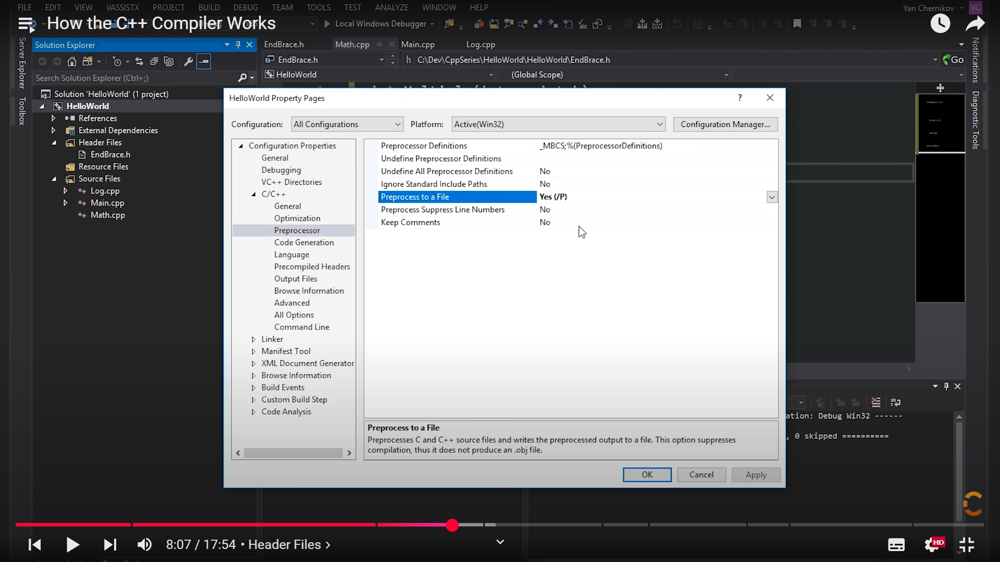
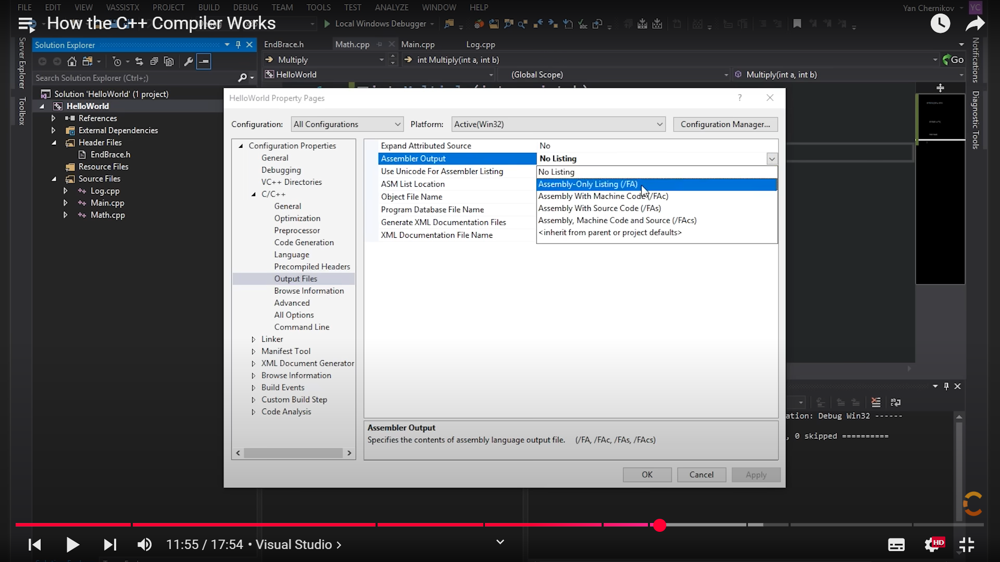
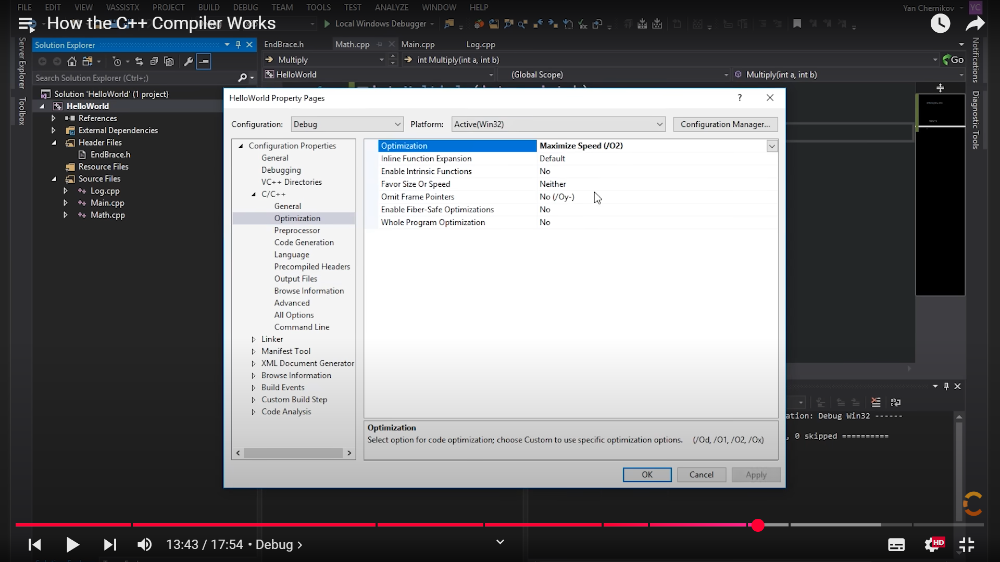

# How C++ Compiler Works - [▶️YouTube](https://www.youtube.com/watch?v=3tIqpEmWMLI&list=PLlrATfBNZ98dudnM48yfGUldqGD0S4FFb&index=6)

**Preprocessing**

The preprocessing stage prepares the source code for further compilation steps. It handles directives like:

- `#include`: Inserts the contents of a specified header file into the source code.
    - Example: Including a header named `EndBrace.h` that simply contains a closing brace:

    ```cpp
    // EndBrace.h
    }
    ```

    ```cpp
    // Math.cpp
    int Multiply(int a, int b) {
        int result = a * b;
        return result;
    }
    #include "EndBrace.h"
    ```

- `#define`: Replaces occurrences of an identifier with a specified value throughout the code.
    - Example: Defining a macro `INTEGER` for `int`:

    ```cpp
    // Math.cpp
    #define INTEGER int
    INTEGER Multiply(int a, int b) {
        INTEGER result = a * b;
        return result;
    }
    ```

- `#if`, `#ifdef`, `#ifndef`, `#else`, `#endif`: Conditionally include or exclude code blocks based on specified conditions.
    - Example: Including the `Multiply` function definition only if a condition is true:

    ```cpp
    // Math.cpp
    #if 1  // Assuming the condition is always true in this example
    int Multiply(int a, int b) {
        int result = a * b;
        return result;
    }
    #endif
    ```

### **Generating Preprocessed Output**



In development environments like Visual Studio, you can configure the compiler to generate a preprocessed file (usually with a `.i` extension) by enabling the "Preprocess to a File" option under C/C++ properties. This helps examine the code after preprocessing.

### **Generating Assembly Output**



Similarly, you can configure the compiler to generate assembly language output (usually with a `.asm` extension) by setting the "Assembler Output" option under C/C++ properties to "Assembly-Only Listing (/FA)". Assembly code represents a low-level representation of the program that can be understood by the machine.

### **Generating Optimized Assembly Output**



Compilers often provide optimization options to improve the program's performance. These optimizations can include:

- **Constant Folding:** Evaluating constant expressions at compile time. For example, `2 + 3` would be directly replaced with `5`.
- **Inlining:** Replacing function calls with their actual code, eliminating function call overhead.
- **Loop Unrolling:** Expanding loops by replicating their contents, potentially reducing loop overhead.
- **Register Allocation:** Assigning variables to registers for faster access.


**Addressing the `cl` Compiler Error D8016**

`cl : command line  error D8016: '/O2' and '/RTC1' command-line options are incompatible`

* **`/O2`**: This option enables **maximum speed optimization**. It instructs the compiler to aggressively optimize the generated code for performance, potentially sacrificing some debugging information.
* **`/RTC1`**: This option enables **Run-Time Checks (level 1)**. It instructs the compiler to insert code to check for common runtime errors like stack frame overruns, uninitialized variables, and invalid parameter values. These checks can slow down the program's execution and are used for debugging.

This error occurs when using the `cl` compiler with the `/O2` (maximum speed optimization) and `/RTC1` (Run-Time Checks level 1) options together. These options are incompatible because runtime checks can interfere with aggressive optimizations.

**Resolution:**

 **Set "Runtime Checks" to "Default":**
   - In your project's properties, navigate to "C/C++" -> "Code Generation."
   - Change the "Runtime Checks" setting to "Default." This allows the compiler to automatically adjust runtime checks based on the chosen optimization level, minimizing conflicts.
